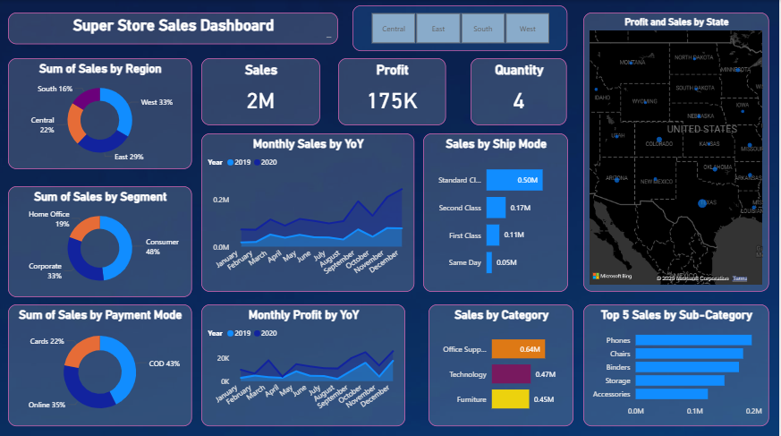
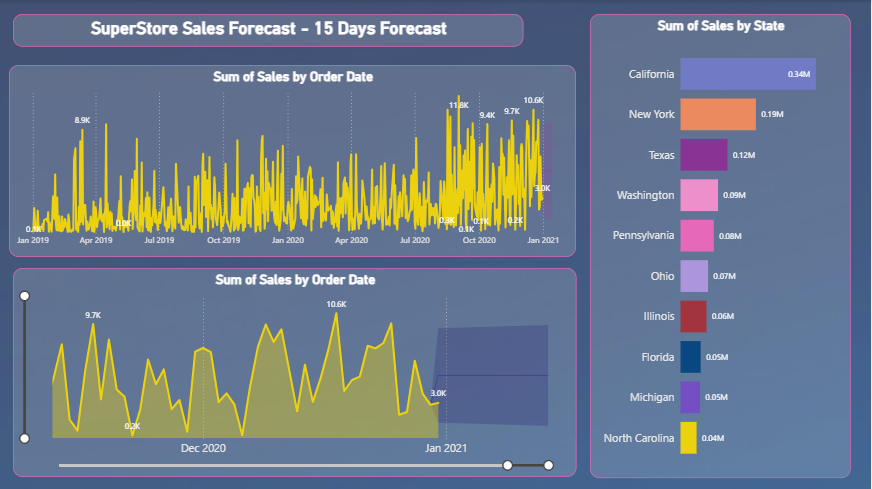

# 📊 Retail Sales Analytics Dashboard

### **Short Description**  
A visually engaging and insight-driven Power BI dashboard designed to help businesses analyze sales performance across regions, categories, customer segments, and retailers.  
It highlights key revenue trends, profitability, and product insights to support data-driven strategic decisions.

---

### 🧰 **Tech Stack**
- **Power BI Desktop**  
- **Power Query**  
- **DAX (Data Analysis Expressions)**  
- **Excel (Raw Sales Dataset)**

---

### 🗂️ **Data Source**
The dataset contains retail sales records including:  
- Order details (order date, discounts, quantity, profit)  
- Customer segments  
- Product categories and sub-categories  
- Regions and states  
- Shipping modes  

The data was cleaned, transformed, and modeled in Power Query before the dashboard build.

---

### 🌟 **Features & Highlights**

#### **1. Business Problem**  
The business needed visibility into regional sales trends, product performance, and profitability to optimize pricing strategies, inventory planning, and promotional activities.

#### **2. Goal of the Dashboard**  
To provide a unified analytical view of retail sales performance — helping decision-makers track KPIs, compare regions, evaluate product categories, and identify growth opportunities.

#### **3. Walkthrough of Key Visuals**
- **KPI Cards** → Total Sales, Total Profit, Units Sold  
- **Sales by Region** → East, West, Central, South  
- **Monthly Sales Trend** → Seasonality and performance fluctuations  
- **Sales by Customer Segment** → Consumer, Home Office, Corporate  
- **Sales by Ship Mode** → Standard, First Class, Same Day  
- **Top 5 Sub-Categories by Sales** → Identifying best-selling product groups  
- **Sales by Category** → Technology, Furniture, Office Supplies  
- **Profit by State** → Geographic visualization of profitability  

#### **4. Business Impact & Insights**
- Identified regions contributing the most/least to total revenue  
- Highlighted the highest and lowest performing product categories  
- Revealed seasonal sales patterns useful for forecasting  
- Showed customer segment behavior and shipping preferences  
- Provided insights to optimize pricing, inventory, and marketing decisions  

---

### 🖼️ **Screenshots**

---

### 👩‍💻 **Author**
**Mariah Qazi**  
📧 mariahqazi8@gmail.com  
🔗 [LinkedIn](https://www.linkedin.com/in/mariah-qazi)

### 🏁 **Summary**
This Power BI project delivers a comprehensive overview of retail sales performance through interactive visuals and clean data modeling.  
It helps uncover key trends, identify strong-performing segments, and support strategic planning for business growth.

